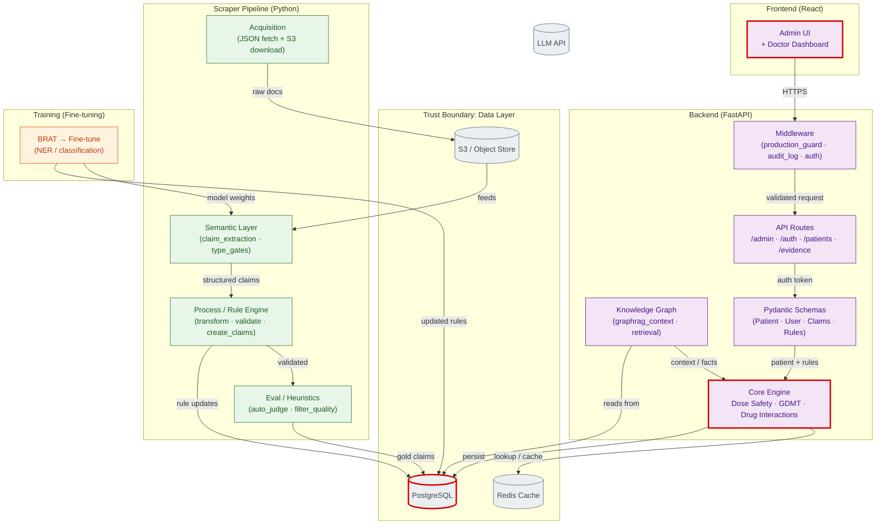

# Runtime Architecture — hf_cdss

## Cards

### 1. Admin UI + Doctor Dashboard
React application serving two roles: clinical administration (rule management, audit history, bulk approvals) and point-of-care decision support.

### 2. FastAPI Middleware Stack
`production_guard_middleware` — blocks access in non-production; `audit_logging` — appends to audit trail on every mutation; `auth` — JWT/OAuth2 token validation.

### 3. Core Clinical Engine
Three rule engines in one process: **Dose Safety** (dose-range checking against rules), **GDMT Policy** (guideline-directed medical therapy adherence), **Drug Interaction** (cross-reference against constraint rules). All three share the same schema layer.

### 4. Knowledge Graph Retrieval
`graphrag_context` / `retrieval_context` — builds structured clinical context from the graph DB for LLM grounding. Feeds the core engine facts retrieved at query time.

### 5. Claim Extraction (Semantic Layer)
`claim_extraction` parses unstructured text into structured `Claim` objects. `claim_type_gates` apply structural validation gates (numeric threshold, temporal, comparative, etc.).

### 6. Scraper Acquisition
JSON API fetching + S3 download. Feeds raw documents into the pipeline. `acquisition/json` community handles the download/parse logic.

### 7. Process / Rule Engine
`transform` → `validate` → `create_claims`. Takes raw claims through quality filtering and writes approved rules back to PostgreSQL.

### 8. Evaluation / Auto-Judge
`auto_judge` + `filter_claims_for_quality` — heuristic and LLM-based scoring of claim accuracy. Produces `gold` claims for the evaluation set.

### 9. Fine-tuning Pipeline
BRAT-annotated clinical text → fine-tune NER/classification models → updated weights flow back into `claim_extraction`.

### 10. Data Layer
- **PostgreSQL** — primary store: users, patients, rules, audit logs, gold claims
- **Redis** — L1 cache for rule lookups (`_reset_constraint_cache` triggered on rule mutation)
- **S3** — raw document blob store for scraped content

---

**Trust boundaries:**
- Frontend is entirely outside the backend trust perimeter — every request is re-authenticated server-side
- LLM API is an external call; no clinical facts are trusted from LLM output without graph grounding
- Scraper pipeline writes to the same PostgreSQL as the live API; a separate eval schema (`claims_gold`) provides a staging gate before production rule activation
